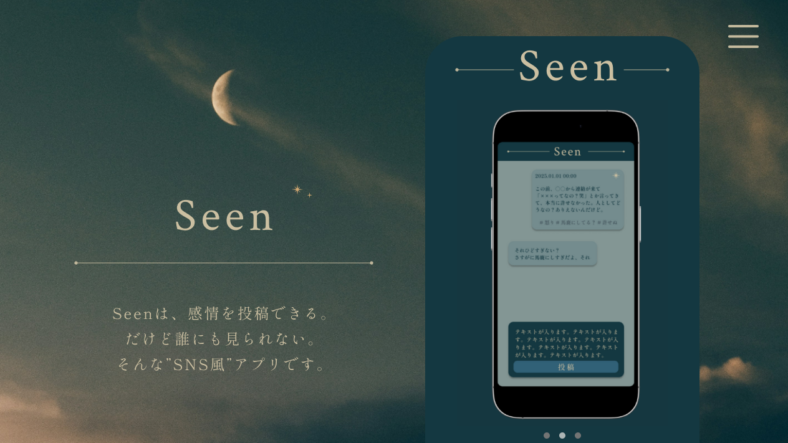

# Seen｜感情を落ち着いて書き出せる、クローズドSNS風アプリ

  

## 📝 プロジェクト概要

このリポジトリは、架空プロダクト「Seen」の**ランディングページ（LP）**を制作するプロジェクトです。  
「Seen」は、感情的な投稿に後悔した経験のある人に向けて、  
**“誰にも見られずに感情を吐き出せる”クローズドSNS風アプリ**をコンセプトとしています。

現在は LP の構成・UI・コピー設計に注力しており、アプリ本体は未実装です。

## 🔗 公開先・関連リンク

- 🔗 [LPデモを見る](https://xxxxx.vercel.app)
- 🖌️ [Figmaデザイン](https://www.figma.com/design/LSIV8C5USGhu1bXSjeKVqW/Seen?node-id=0-1&t=g1qDd2W9hV1XfdLv-1)
- 🛠️ [GitHubリポジトリ](https://github.com/nishimura-h119/seen-lp)

## 🎨 担当領域

- FigmaでのUIデザイン
- LP構成設計（セクション分割・導線設計）
- コーディング（レスポンシブ対応含む）
- コピーライティング（LP文章作成）

## 🛠 技術スタック

| 項目           | 使用技術                                      |
| -------------- | --------------------------------------------- |
| フロントエンド | Next.js (App Router), Tailwind CSS, Shadcn UI |
| 言語           | TypeScript                                    |
| デプロイ       | Vercel                                        |
| その他         | OpenAI API（※機能追加予定）                   |

## 💡 工夫したポイント

- **GPTによる架空リアクション**でユーザーの感情整理をサポート
- **モバイル中心の構成**を意識し、スマホでも没入感があるUIに設計
- **色彩設計・余白・タイポグラフィ**を通して「静かな安心感」を演出

## 🚧 今後の展望（ToDo）

- ログイン機能の追加（現在はスタティックLPのみ）
- GPTとのやり取りを保存できる履歴機能
- 投稿のテーマに応じた反応分類アルゴリズムの調整
